# Interface's description
To see every aspect of each view, every image displayed here will have a zoom of 75%. Also, visible content of the app is in spanish, and so the examples that will be shown. 

The first thing that will be seen when someone enter in the web site will be the main page, this one presents the app's purpose and show information about donations and requests that have been added, and others extra details that are useful to have a better experience. So, let's see the main page: 

## Main page
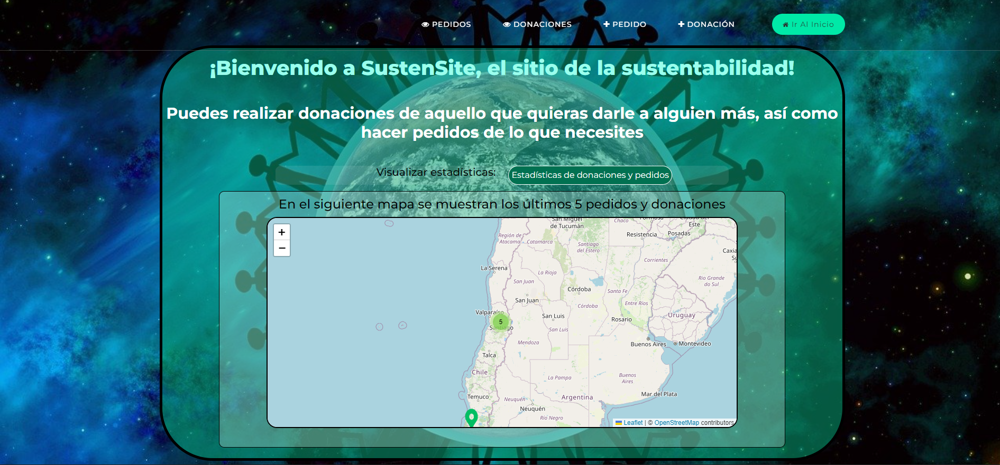

In the previous image, the map displays the most recent five requests and five donations. As shown in the image, when some of them are relatively close to each other, they aggregate into clusters. Additionally, when the mouse is placed over the header, it gets highlighted. So, the next image shows this aspects told before: 

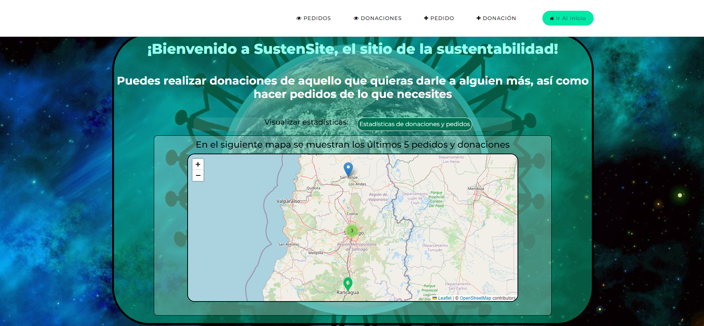

## Add request
If someone attempts to access the request's list view when there are no requests yet, it will automatically redirect to the 'Add request' interface. However, you can also navigate to this interface from the home page or any of the other main pages. The interface is as follows:

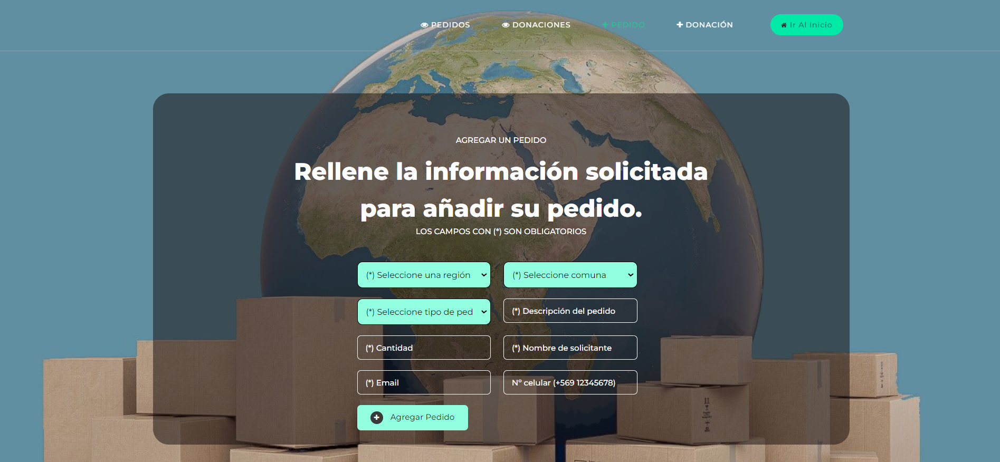

When all the required fields are filled out, and someone attempts to submit the request, a confirmation alert will be displayed:

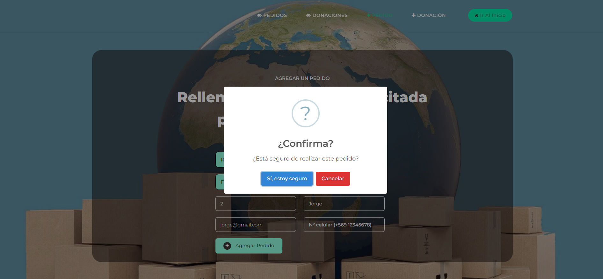

Now, there are two possible scenarios. If any errors are detected in the fields, an error alert will appear. In this example, the email format is incorrect:

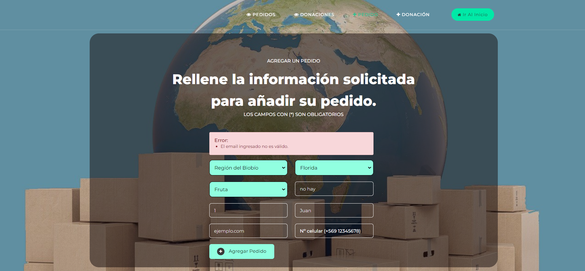

On the other hand, if there are no errors, a success alert will be displayed:

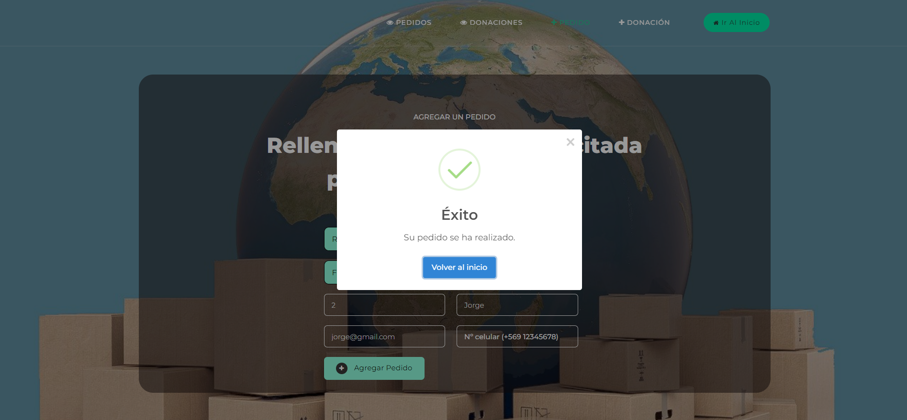

## Add donation
Mostly the same as 'Add request' interface, and it look as it follows:

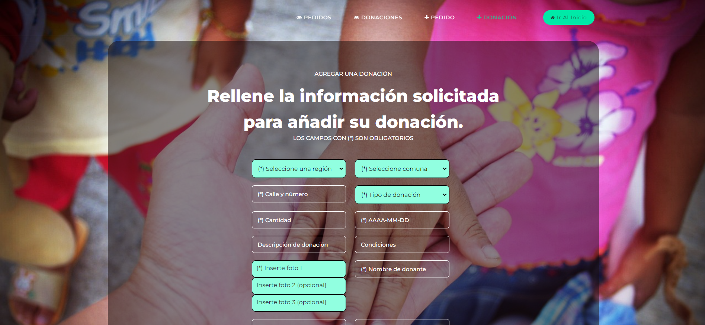

## Requests list
This interface displays all the requests placed up to the present moment, showing the most recent ones first. To enhance comprehension, pagination is performed in groups of five requests. Additionally, clicking on any order will take to a view with more detailed information about it; this interface will be presented later. Below are the interfaces for when there are not enough requests for pagination and when there are enough:

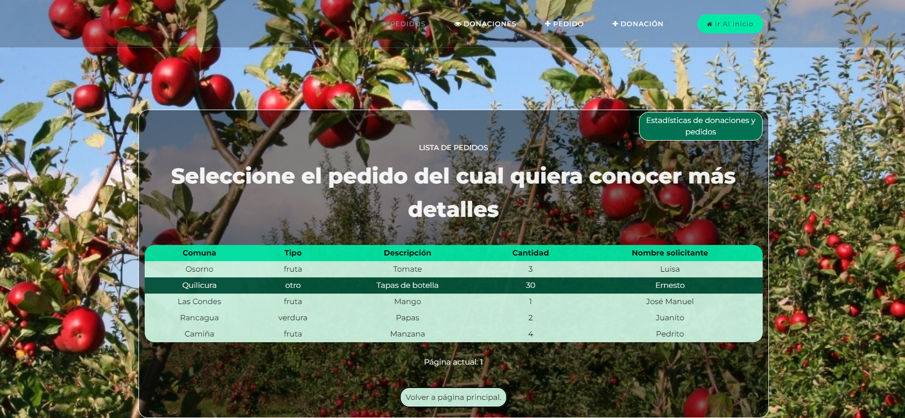

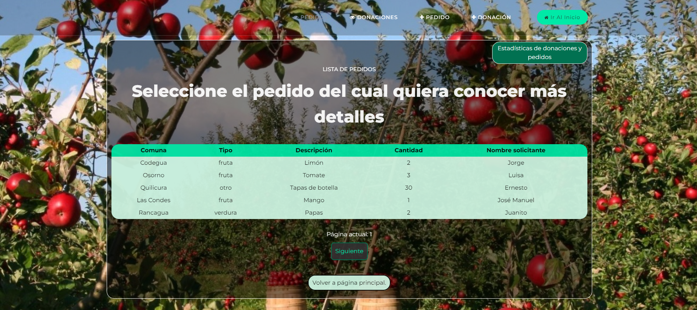

## Donations list
Just like the previous interface, this one does the same but with donations:

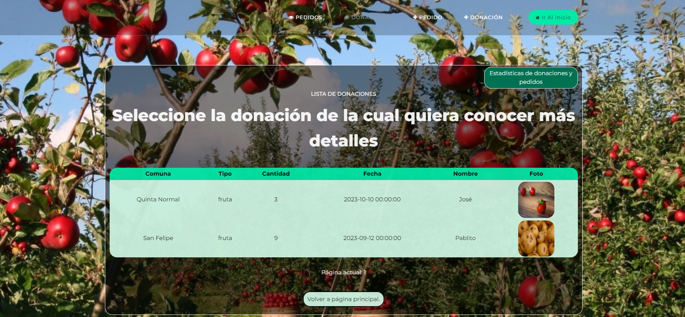

## Request's information
Information of the selected request in the request view is displayed, and there's a button to return to the request view.

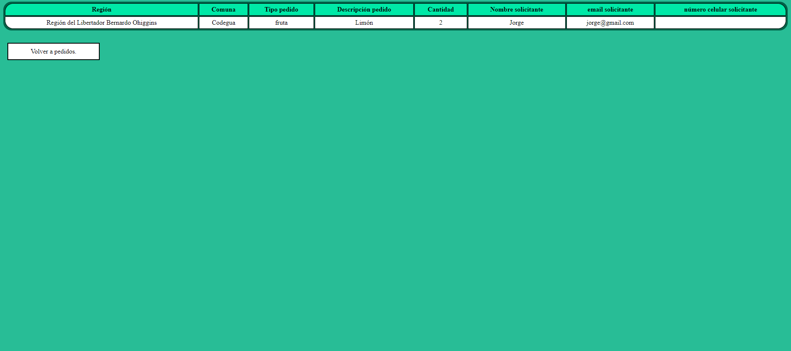

## Donation's information
Information of the selected donation in the donation view is displayed, and there's a button to return to the donation view.

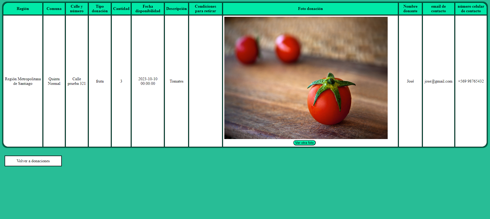

But, if the donation selected has more than one photo, a button will be displayed below the image, and if it gets pressed, next image will be shown:

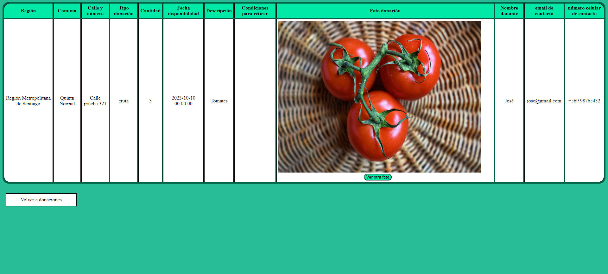

## Stats
The only remaining interface is the one that displays stats for requests and donations. It can be accessed from the main page as well as from the donation and request views. This interface shows the total number of requests and donations that have been added, along with the quantity of each type (fruit, vegetable, or other).

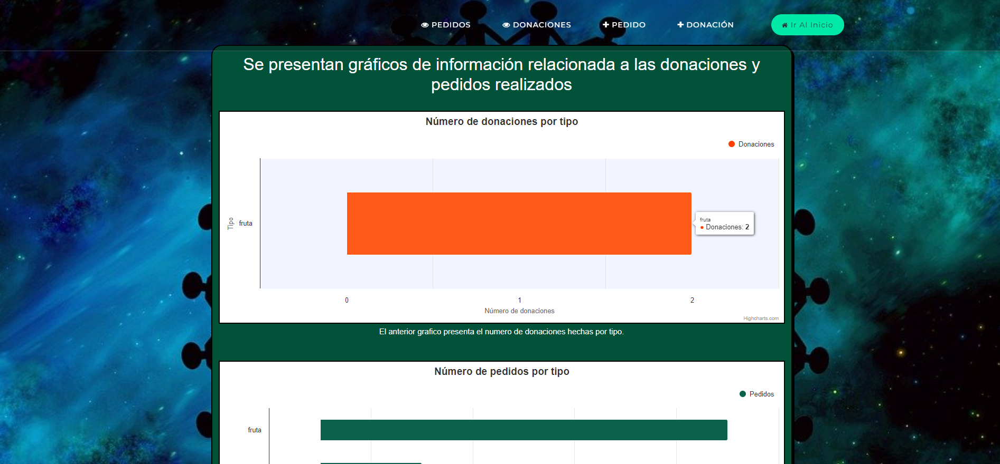